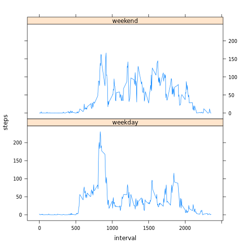

# Reproducible Research: Peer Assessment 1

## Loading and preprocessing the data
### Unzip the data file

```r
zip_file = "activity.zip"
# unzip(zip_file)
```

### Load data

```r
data_file = "activity.csv"
data = read.csv(data_file, sep = ",")
# Cast dates as date format
data$date = as.Date(data$date, format = "%Y-%m-%d")
# str(data)
```

## What is mean total number of steps taken per day?

```r
library(sqldf)
```

```
## Loading required package: gsubfn
## Loading required package: proto
## Loading required namespace: tcltk
## Loading required package: RSQLite
## Loading required package: DBI
## Loading required package: RSQLite.extfuns
```

```r
data_steps_day = sqldf("select date, sum(steps) as steps from data group by date")
```

```
## Loading required package: tcltk
```

```r
hist(data_steps_day$steps, breaks = 10, main = "Number of steps by day", xlab = "Number of steps")
abline(v = mean(data_steps_day$steps, na.rm = T), col = "red", lty = 1)
abline(v = median(data_steps_day$steps, na.rm = T), col = "blue", lty = 9)
```

 


The mean (red) of the number of steps is 1.0766 &times; 10<sup>4</sup>.  
The median (blue) of the number of steps is 10765.

## What is the average daily activity pattern?

```r
data_ave_interval = sqldf("select interval, 100*avg(steps) as steps from data group by interval")
plot(x = data_ave_interval$interval, y = data_ave_interval$steps/100, type = "l", 
    main = "Average number of steps by time interval", xlab = "Time interval", 
    ylab = "Number of steps")
```

 

### Which 5-minute interval, on average across all the days in the dataset, contains the maximum number of steps?
It is the interval 835.

## Imputing missing values
### Calculate and report the total number of missing values in the dataset (i.e. the total number of rows with NAs)

```r
colSums(is.na(data))
```

```
##    steps     date interval 
##     2304        0        0
```


### Devise a strategy for filling in all of the missing values in the dataset. The strategy does not need to be sophisticated
Set the value to the average for that interval

### Create a new dataset that is equal to the original dataset but with the missing data filled in.

```r
u = is.na(data$steps)
v = data[u, "interval"]
data_na <- data
data[u, ]$steps <- data_ave_interval[match(v, data_ave_interval$interval), "steps"]/100
```

### Make a histogram of the total number of steps taken each day and Calculate and report the mean and median total number of steps taken per day. Do these values differ from the estimates from the first part of the assignment? What is the impact of imputing missing data on the estimates of the total daily number of steps?

```r
data_steps_day2 = sqldf("select date, sum(steps) as steps from data group by date")
par(mfrow = c(2, 1))
hist(data_steps_day$steps, breaks = 10, main = "Number of steps by day (with NAs)", 
    xlab = "Number of steps")
abline(v = mean(data_steps_day$steps, na.rm = T), col = "red", lty = 1)
abline(v = median(data_steps_day$steps, na.rm = T), col = "blue", lty = 9)
hist(data_steps_day2$steps, breaks = 10, main = "Number of steps by day (without NAs", 
    xlab = "Number of steps")
abline(v = mean(data_steps_day$steps, na.rm = T), col = "red", lty = 1)
abline(v = median(data_steps_day$steps, na.rm = T), col = "blue", lty = 9)
```

 

```r
par(mfrow = c(1, 1))
```


The mean (red) of the number of steps is now 1.0766 &times; 10<sup>4</sup>.  
The median (blue) of the number of steps is now 10765.
```
## Are there differences in activity patterns between weekdays and weekends?

```r
data$weektime = "weekday"
data[weekdays(data$date, abbreviate = T) %in% c("sam.", "dim."), ]$weektime = "weekend"
data$weektime = as.factor(data$weektime)

data_ave_interval = sqldf("select interval, weektime, 100*avg(steps) as steps from data group by interval, weektime")
library(lattice)
xyplot(steps/100 ~ interval | weektime, data_ave_interval, type = "l", layout = c(1, 
    2), ylab = "steps")
```

 

